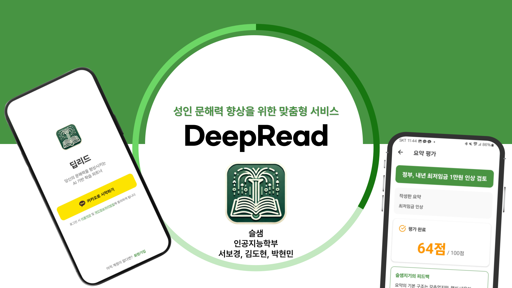
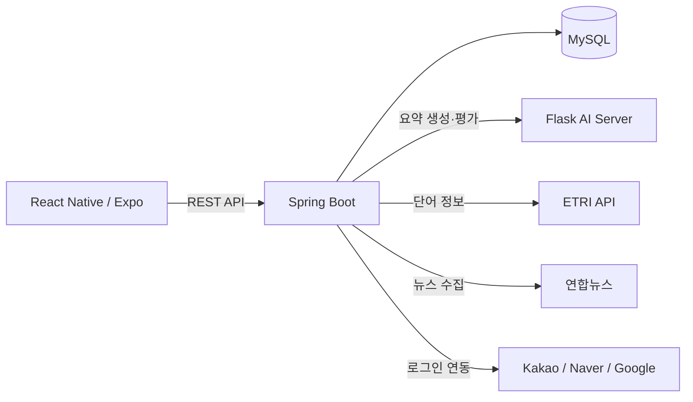

<div align="center">

# DeepRead Backend

실생활 문서를 활용해 성인의 문해력 진단부터 요약 훈련과 AI 피드백까지 제공하는 맞춤형 학습 서비스의 백엔드입니다.



**프로젝트 기간** 2025.03.05 ~ 2025.06.13<br>
**개발 기간** 2025.04.28 ~ 2025.06.13

</div>

> 캡스톤디자인 프로젝트로 개발했으며, 현재 서비스와 AWS 인프라는 운영하지 않습니다.

## 프로젝트 소개

공공기관 안내문, 금융·보험 문서, 의료 정보처럼 일상에서 반드시 읽어야 하는 문서는 전문 용어와 복잡한 문장 구조 때문에 핵심을 파악하기 어렵습니다. 기획 단계에서 성인 70명을 대상으로 설문한 결과, **71%가 실생활 문서 이해에 어려움을 경험**했고 **81%가 문해력 향상 앱을 사용할 의향**이 있다고 답했습니다.

DeepRead는 AI가 문서를 대신 읽어주는 데 그치지 않고, 사용자가 직접 원문을 읽고 요약한 뒤 평가와 피드백을 받도록 설계했습니다. 진단 결과에 맞는 문서를 제공하고 어휘·퀴즈·학습 기록을 연결해, 실생활에서 필요한 문해력을 반복해서 훈련하는 것이 목표입니다.

## 핵심 기능

| 기능 | 설명 |
| --- | --- |
| 문해력 진단 | 유형별 5개 문항으로 현재 수준을 진단하고 사용자 레벨 저장 |
| 맞춤형 콘텐츠 | 레벨에 맞는 법률·의료 문서와 매일 수집한 뉴스 제공 |
| 요약 훈련 | 사용자 요약문을 AI 서버에서 평가해 점수와 피드백 제공 |
| 어휘·퀴즈 학습 | 단어 뜻·유의어·반의어 조회와 수준별 랜덤 퀴즈 지원 |
| 학습 통계 | 요약·퀴즈 기록, 학습 캘린더, 연속 학습일과 2주 리포트 제공 |

## Backend 핵심 구현

### 1. 진단 결과 기반 콘텐츠 추천

- 문항 유형 A·B·C에서 각각 1·2·2개를 무작위로 조합해 5문항을 제공합니다.
- 진단 점수와 레벨을 저장하고, 법률·의료 콘텐츠는 사용자 레벨로 조회합니다.
- 뉴스는 시사 학습을 위해 레벨과 무관하게 함께 제공합니다.

### 2. 서로 다른 콘텐츠를 하나의 학습 흐름으로 통합

법률·의료·뉴스가 서로 다른 테이블과 ID를 사용하므로, `Content` 테이블에 `category + externalId` 매핑을 두었습니다. 클라이언트는 콘텐츠 종류와 무관하게 하나의 `contentId`만 전달하고, 백엔드가 실제 원문과 AI 요약을 찾아 동일한 요약 훈련 흐름으로 연결합니다.

### 3. 사용자 참여형 AI 요약 평가

```text
사용자 요약 제출 → 원문·AI 요약 조회 → Flask 평가 API 호출
                 → 점수·피드백 검증 → 학습 결과 저장
```

- 원문, 사용자 요약, AI 요약을 Flask 서버의 `/evaluate`로 전달합니다.
- 평가 결과를 트랜잭션으로 저장하고, 당시 원문을 `contentSnapshot`으로 보관해 원본 데이터가 바뀌어도 과거 학습 기록을 다시 볼 수 있게 했습니다.
- AI 응답의 점수 타입을 `Number`로 검증한 뒤 `Double`로 정규화해 정수·실수 응답을 모두 처리합니다.

### 4. 뉴스 수집과 AI 요약 자동화

- Jsoup으로 연합뉴스 7개 카테고리의 최신 기사를 수집합니다.
- 카테고리별 당일 데이터가 있으면 수집을 건너뛰어 중복 저장과 불필요한 외부 요청을 줄였습니다.
- 수집 직후 공통 `Content`에 등록하고, 별도 스케줄러가 `aiSummary`가 없는 기사만 AI 서버에 요청합니다.

### 5. 어휘·퀴즈·학습 통계 연결

- ETRI 어휘 API 응답에서 품사별 뜻, 유의어, 반의어를 추출하고 사용자별 중복 단어 저장을 방지했습니다.
- 레벨별 문제 중 5개를 무작위로 제공하고 정답 검증 결과와 최종 정확도를 저장합니다.
- 요약 수, 퀴즈 완료 수, 학습 단어 수, 최근 30일 연속 학습일을 집계하고 요약·퀴즈 평균으로 2주 단위 리포트를 생성합니다.

## 시스템 아키텍처



## 기술 스택

| 구분 | 기술 |
| --- | --- |
| Backend | Java 17, Spring Boot 3.2.5, Spring Data JPA, Spring Security |
| Auth | Social Login, JWT, Access·Refresh Token |
| Database | MySQL 8 |
| Integration | REST API, Jsoup, Springdoc OpenAPI |
| Infra | Gradle, Docker, AWS EC2 |

## 핵심 트러블슈팅

### 콘텐츠별 식별자 불일치

법률·의료·뉴스의 ID 체계가 달라 요약 요청이 콘텐츠를 일관되게 찾기 어려웠습니다. `Content`에 `category + externalId` 매핑을 두고 모든 콘텐츠 응답에 `contentId`를 포함해, `SummaryService`가 하나의 흐름으로 원문과 AI 요약을 조회하도록 통합했습니다.

### AI 평가 점수 타입 불일치

Flask 응답의 `score`가 값에 따라 정수 또는 실수로 역직렬화되어 직접 형변환 시 오류가 발생했습니다. 응답을 `Number`로 검증한 뒤 `doubleValue()`로 정규화하고, 숫자가 아니면 명시적인 평가 예외를 반환하도록 수정했습니다.

## 담당 범위

**박현민 — Backend 단독 구현**

- Spring Boot REST API와 MySQL 데이터 모델 설계·구현
- Kakao·Naver·Google 소셜 로그인, JWT·Refresh Token 인증 구현
- Flask AI 서버 연동, 뉴스 수집·요약 스케줄링 구현
- Swagger API 문서화, Docker 기반 AWS EC2 배포

## Team

| 이름 | 역할 |
| --- | --- |
| 서보경 | Frontend |
| 김도현 | AI |
| **박현민** | **Backend** |

## 프로젝트 및 후속 성과

- 2025 전남대학교 소프트웨어중심대학사업 교내 디지털경진대회 **SW 부문 동상**
- 2025 한국스마트미디어학회 춘계학술대회 포스터 발표
- 디지털콘텐츠학회논문지(JDCS) Vol.26 No.12, pp.3477–3484 게재: [DeepRead: 생성형 AI를 활용한 성인 맞춤형 문해력 향상 서비스](https://doi.org/10.9728/dcs.2025.26.12.3477)

## Repository

| 영역 | 저장소 |
| --- | --- |
| Frontend | [Deepread_FE](https://github.com/hyeonminee/Deepread_FE) |
| Backend | [Deepread_BE](https://github.com/hyeonminee/Deepread_BE) |
| AI | [Deepread_AI](https://github.com/hyeonminee/Deepread_AI) |
