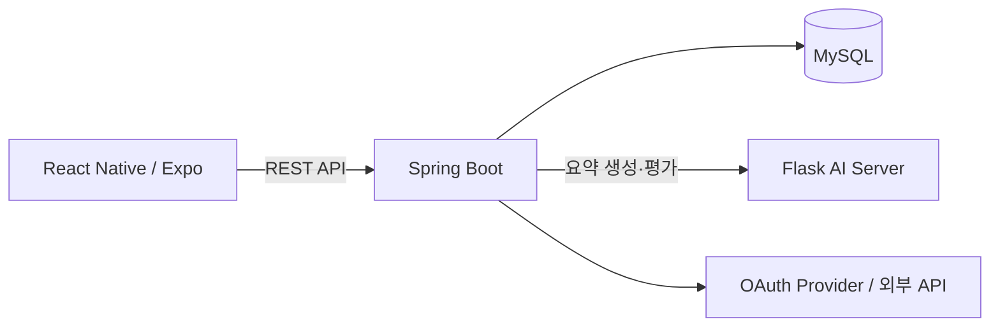

# DeepRead Backend

실생활 문서를 활용해 성인의 문해력 진단부터 요약 훈련과 AI 피드백까지 제공하는 맞춤형 학습 서비스의 백엔드입니다.

**프로젝트 기간** 2025.03.05 ~ 2025.06.13 
**개발 기간** 2025.04.28 ~ 2025.06.13

> 캡스톤디자인 프로젝트로 개발했으며, 현재 서비스와 AWS 인프라는 운영하지 않습니다.

## 핵심 기능

- **문해력 진단**: 5개 문항을 채점해 사용자를 초급·중급·고급으로 분류
- **맞춤형 콘텐츠**: 진단 수준에 맞는 법률·의료 문서와 매일 수집한 뉴스 제공
- **요약 훈련**: 사용자 요약문을 AI 서버로 평가하고 점수와 피드백 저장
- **어휘·퀴즈 학습**: 단어 뜻·유의어·반의어 조회, 단어장과 수준별 퀴즈 지원
- **학습 통계**: 요약·퀴즈 기록, 학습 캘린더, 연속 학습일과 2주 단위 리포트 제공

## 담당 범위

**박현민 — Backend 단독 구현**

- Spring Boot REST API와 MySQL 데이터 모델 설계·구현
- Kakao·Naver·Google 소셜 로그인, JWT·Refresh Token 인증 구현
- Flask AI 서버 연동, 뉴스 수집·요약 스케줄링 구현
- Swagger API 문서화, Docker 기반 AWS EC2 배포

## 기술 스택

| 구분 | 기술 |
| --- | --- |
| Backend | Java 17, Spring Boot 3.2.5, Spring Data JPA, Spring Security |
| Auth | OAuth2, JWT |
| Database | MySQL 8 |
| Integration | REST API, Jsoup, Springdoc OpenAPI |
| Infra | Gradle, Docker, AWS EC2 |

## 시스템 아키텍처

## 핵심 트러블슈팅

### 콘텐츠별 식별자 불일치

법률·의료·뉴스가 서로 다른 테이블과 ID를 사용해 요약 훈련 요청이 콘텐츠를 일관되게 찾기 어려웠습니다. `Content`에 `category + externalId` 매핑을 두고 모든 콘텐츠 응답에 `contentId`를 포함해, `SummaryService`가 하나의 흐름으로 원문과 AI 요약을 조회하도록 통합했습니다.

### AI 평가 점수 타입 불일치

Flask 응답의 `score`가 값에 따라 정수 또는 실수로 역직렬화되어 직접 형변환 시 오류가 발생했습니다. 응답을 `Number`로 검증한 뒤 `doubleValue()`로 정규화하고, 숫자가 아니면 명시적인 평가 예외를 반환하도록 수정했습니다.

## Team

| 이름 | 역할 |
| --- | --- |
| 서보경 | Frontend |
| 김도현 | AI |
| **박현민** | **Backend** |

## 프로젝트 및 후속 성과

- 2025 전남대학교 소프트웨어중심대학사업 교내 디지털경진대회 **SW 부문 동상**
- 2025 한국스마트미디어학회 춘계학술대회 포스터 발표
- 디지털콘텐츠학회논문지(JDCS) Vol.26 No.12, pp.3477–3484 게재: [DeepRead: 생성형 AI를 활용한 성인 맞춤형 문해력 향상 서비스](https://doi.org/10.9728/dcs.2025.26.12.3477)

## Repository

| 영역 | 저장소 |
| --- | --- |
| Frontend | [Deepread_FE](https://github.com/hyeonminee/Deepread_FE) |
| Backend | [Deepread_BE](https://github.com/hyeonminee/Deepread_BE) |
| AI | [Deepread_AI](https://github.com/hyeonminee/Deepread_AI) |
